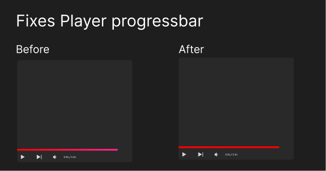
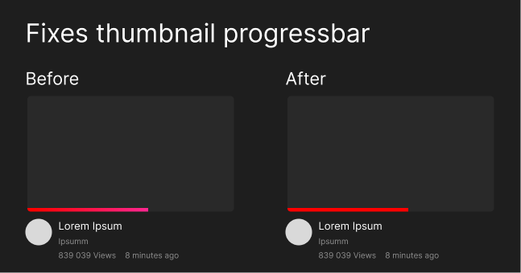

# Fix pink youtube

> A firefox add-on to make youtube red again

## Features

- Changes the progress bar in the main player to red
- Changes the progress bar in thumbnails to red

This add-on will try to keep up with future changes that youtube makes to colors to keep it red

## Getting started

### 🛠 Build locally

1. Clone
1. Run `npm install` to install all required dependencies
1. Run `npm run build`

The build step will create the `distribution` folder, this folder will contain the generated extension.

### 🏃 Run the extension

Using [web-ext](https://extensionworkshop.com/documentation/develop/getting-started-with-web-ext/) is recommended for automatic reloading and running in a dedicated browser instance. Alternatively you can load the extension manually (see below).

1. Run `npm run watch` to watch for file changes and build continuously
1. Run `npm install --global web-ext` (only only for the first time)
1. In another terminal, run `web-ext run -t chromium`
1. Check that the extension is loaded by opening the extension options ([in Firefox](media/extension_options_firefox.png) or [in Chrome](media/extension_options_chrome.png)).

#### Manually

You can also [load the extension manually in Chrome](https://www.smashingmagazine.com/2017/04/browser-extension-edge-chrome-firefox-opera-brave-vivaldi/#google-chrome-opera-vivaldi) or [Firefox](https://www.smashingmagazine.com/2017/04/browser-extension-edge-chrome-firefox-opera-brave-vivaldi/#mozilla-firefox).

## Extensions created using this template

- [notlmn/copy-as-markdown](https://github.com/notlmn/copy-as-markdown) - Browser extension to copy hyperlinks, images, and selected text as Markdown.
